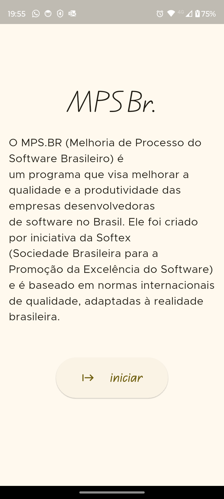
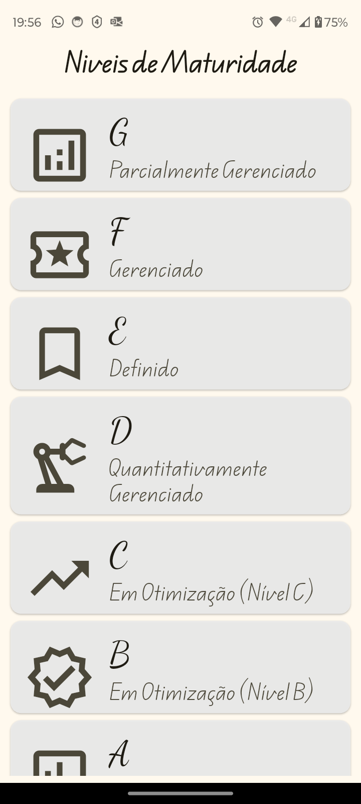
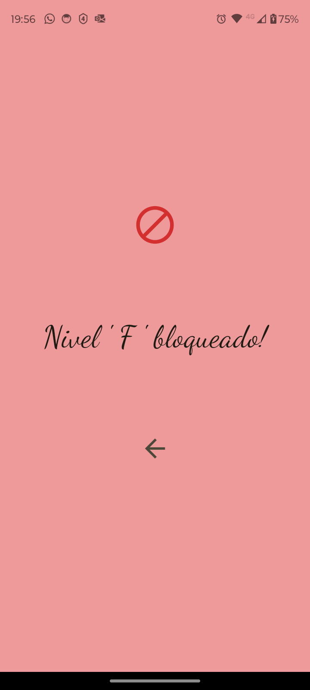
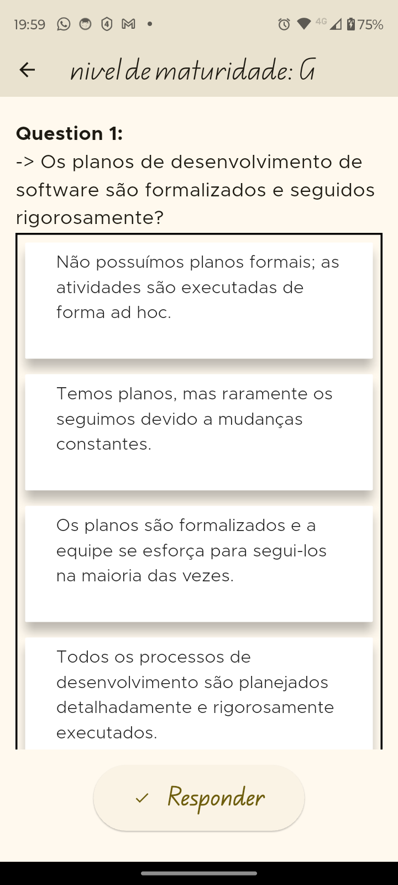
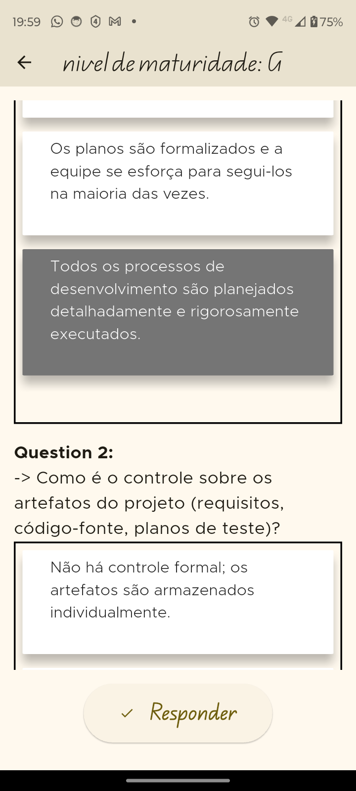
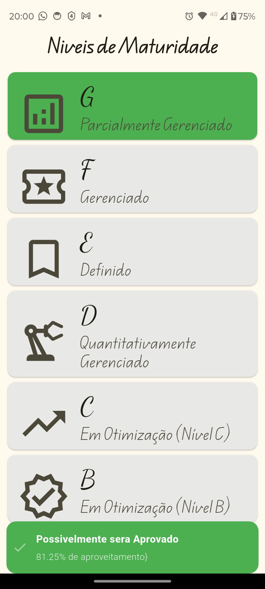
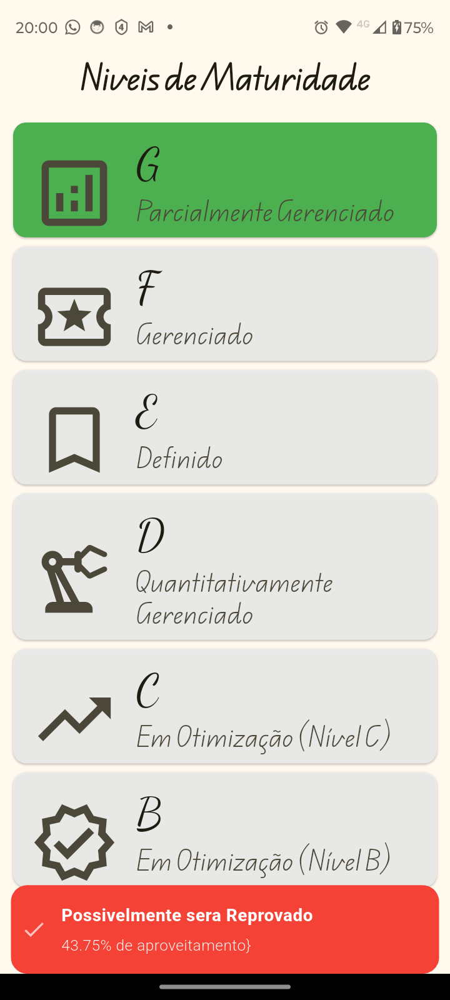

# MSBRApp

## 🇧🇷 Descrição do Projeto (Portuguese)

MSBRApp é um aplicativo Flutter projetado para avaliar níveis de maturidade com base em um conjunto de perguntas. Cada nível de maturidade possui questões específicas, e o usuário deve responder a elas para determinar se o nível foi "aprovado". O aplicativo utiliza o GetX para gerenciamento de estado.

## 🇺🇸 Project Description (English)

MSBRApp is a Flutter application designed to assess maturity levels based on a set of questions. Each maturity level has specific questions, and the user must answer them to determine if the level has been "approved". The application uses GetX for state management.

## ✨ Funcionalidades Principais / Key Features

*   **Avaliação por Nível:** O aplicativo organiza as avaliações em diferentes níveis de maturidade (G, F, E, D, C, B, A).
*   **Questões Dinâmicas:** As perguntas são carregadas dinamicamente para cada nível.
*   **Múltipla Escolha:** Cada pergunta oferece múltiplas opções de resposta.
*   **Sistema de Pontuação:** As respostas são pontuadas e um percentual de aproveitamento é calculado.
*   **Critério de Aprovação:** Um nível é considerado "aprovado" se o percentual de aproveitamento atingir um limite (atualmente 75%).
*   **Feedback Visual:** O usuário recebe feedback visual (cores e snackbars) sobre suas respostas e o resultado da avaliação.
*   **Gerenciamento de Estado com GetX:** Utiliza o `GetX` para um gerenciamento de estado eficiente e reativo.
*   **Bloqueio de Nível:** Níveis superiores podem ser bloqueados até que os níveis anteriores sejam aprovados.

## 🚀 Começando / Getting Started

Estas instruções fornecerão uma cópia do projeto em execução na sua máquina local para fins de desenvolvimento e teste.

### Pré-requisitos / Prerequisites

*   Flutter SDK (Canal Stable recomendado)
*   Um editor de código como VS Code com as extensões Flutter e Dart, ou Android Studio.
*   Um emulador Android/iOS ou um dispositivo físico.

### Instalação / Installation

1.  **Clone o repositório:**
    ```bash
    git clone https://github.com/DanielBrown1998/msbrapp.git
    cd msbrapp
    ```

2.  **Instale as dependências:**
    ```bash
    flutter pub get
    ```

3.  **Execute o aplicativo:**
    ```bash
    flutter run
    ```

## 🛠️ Estrutura do Projeto / Project Structure

A estrutura de pastas do projeto segue as convenções do Flutter, com os principais diretórios dentro de `lib/`:


A estrutura de pastas do projeto segue as convenções do Flutter, com os principais diretórios dentro de `lib/`:

## 🖼️ Telas do Aplicativo / App Screenshots

<!-- Substitua as URLs e descrições pelas suas imagens -->
<table>
  <tr>
    <td align="center">
      
      <br><sub>Tela de Seleção de Níveis</sub>
    </td>
    <td align="center">
      
      <br><sub>Tela de Perguntas do Nível</sub>
    </td>
  </tr>
  <tr>
    <td align="center">
      
      <br><sub>Feedback de Nível Aprovado</sub>
    </td>
    <td align="center">
      
      <br><sub>Feedback de Nível Reprovado</sub>
    </td>
  </tr>
    <td align="center">
      
      <br><sub>Feedback de Nível Reprovado</sub>
    </td>
  </tr>
    <td align="center">
      
      <br><sub>Feedback de Nível Reprovado</sub>
    </td>
  </tr>
    <td align="center">
      
      <br><sub>Feedback de Nível Reprovado</sub>
    </td>
  </tr>
  
  <!-- Adicione mais <tr> para mais linhas ou mais <td> dentro de um <tr> para mais colunas -->
</table>


## 📦 Principais Dependências / Key Dependencies

*   **flutter/material:** Widgets e temas do Material Design.
*   **get:** Framework para gerenciamento de estado, rotas e dependências.

Consulte o arquivo `pubspec.yaml` para uma lista completa de dependências.

## 🤝 Contribuindo / Contributing

Contribuições são o que tornam a comunidade de código aberto um lugar incrível para aprender, inspirar e criar. Quaisquer contribuições que você fizer serão **muito apreciadas**.

Se você tiver uma sugestão que possa melhorar este projeto, por favor, faça um fork do repositório e crie um pull request. Você também pode simplesmente abrir uma issue com a tag "enhancement".
Não se esqueça de dar uma estrela ao projeto! Obrigado novamente!

1.  Faça um Fork do Projeto
2.  Crie sua Feature Branch (`git checkout -b feature/AmazingFeature`)
3.  Commit suas Mudanças (`git commit -m 'Add some AmazingFeature'`)
4.  Push para a Branch (`git push origin feature/AmazingFeature`)
5.  Abra um Pull Request

## 📄 Licença / License

Distribuído sob a Licença MIT. Veja `LICENSE` para mais informações.
*(Você precisará adicionar um arquivo LICENSE ao seu projeto se desejar incluir esta seção)*

---

Desenvolvido com ❤️ por Daniel Brown

